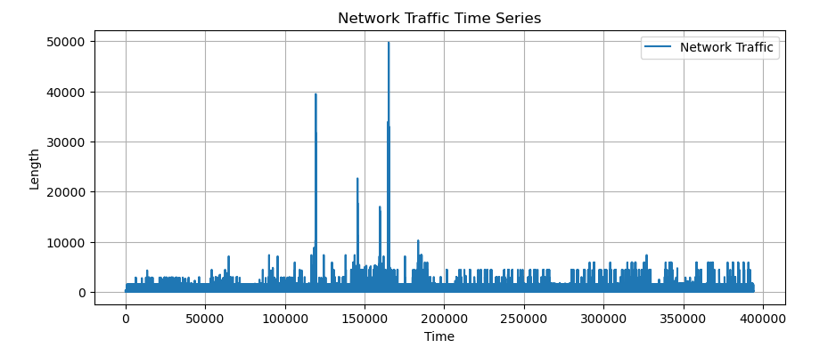
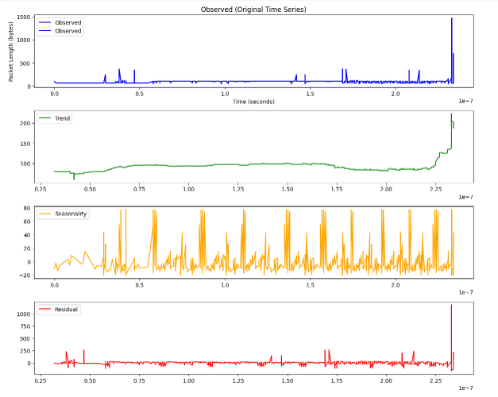

# 🎓 IIT Madras Research Internship – 2025

**Project Title:** Estimation of Parameters of α-Stable Autoregressive Models: A Comparative Study of Covariation and FLOC-Based Methods  
**Intern:** Pooja Kumari (2nd Year B.Tech Student), NIT Mizoram 
**Guide:** Prof. S. Sundar, Department of Mathematics, IIT Madras  

---

## 📜 About the Project
This repository contains the **work completed during my 2025 research internship at IIT Madras**.  

The project explored **time series modeling for heavy-tailed data**, focusing on:
-  **α-stable distributions**  
-  **Classical and modified Yule-Walker methods** for parameter estimation  
-  Application to **network traffic data** to study real-world scenarios

The notebooks here demonstrate code experiments, statistical analysis, and visualizations that were part of this internship.

---

##  Repository Structure
IITM-Internship-2025/

│

├── Notebooks/ → All Google Colab notebooks with code & explanations

├── Graphs/ → Saved plots and figures generated by the notebooks

└── README.md → This file


---

##  How to Use

1️⃣ **Clone the repository:**
```bash
git clone https://github.com/YOUR_USERNAME/IITM-Internship-2025.git
```
2️⃣ **Open any notebook from the notebooks/ folder:**

You can view it on GitHub directly,

Or open it in Google Colab (click “Open in Colab” if you add that badge).

##  Dataset Overview
The analysis in this project uses a **network traffic dataset** from Kaggle:  
[👉 Network Traffic Data – Kaggle Link](https://www.kaggle.com/datasets/ravikumargattu/network-traffic-dataset)

- The dataset contains **`time`** and **`length`** columns, where `length` refers to the size of each network packet (in bytes).
- Due to size and privacy reasons, the dataset is **NOT included** in this repository.
- If you wish to run the notebooks, please download the dataset from the above source and update the path in the code.

**To run notebooks:**

Mount your own Google Drive in Colab:
from google.colab import drive
drive.mount('/content/drive')

Place the dataset in your Drive and update the path in the notebook code.

##  Graphs & Visualizations
All key plots from the analysis are saved separately in the graphs/ folder for quick access.
Here’s a preview of the outputs you’ll find:





(More graphs are inside the /Graphs folder.)

##  Why This Repo Matters
- Demonstrates statistical modeling on real network traffic data

- Explores α-stable models — important for heavy-tailed data like finance & internet traffic

- Provides clean notebooks and saved graphs for easy reference

## ⚠️ Disclaimer
This repository is intended for academic reference only.
The dataset is not included for privacy and size reasons.
Please cite appropriately if you refer to this work.

## 🙏 Acknowledgements
I’m deeply grateful to Prof. S. Sundar for his guidance, to my phd guide Ms. Shreshtha Acharjee and to IIT Madras for providing this research opportunity.

